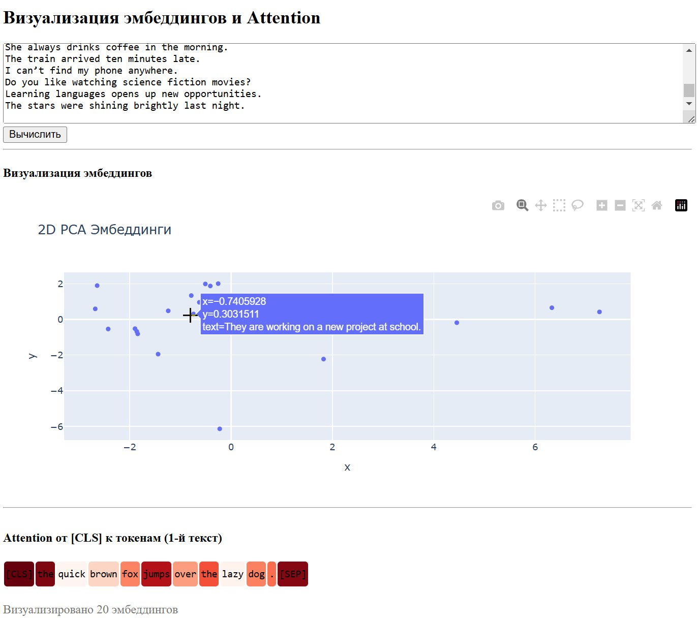

# Шаблон Dash-приложения

## Описание

Этот проект представляет собой **шаблон Dash-приложения**, простой пример, как можно:

- Генерировать эмбеддинги текстов с помощью предобученной модели BERT;
- Выполнять понижение размерности эмбеддингов с помощью PCA;
- Визуализировать эмбеддинги на интерактивной диаграмме (Plotly);
- Отображать веса внимания от токена `[CLS]` ко всем токенам (attention visualization);
- Подсвечивать токены по уровню внимания в виде цветовой шкалы.

  

## Установка и запуск

### 1. Клонировать репозиторий

```bash
git clone https://github.com/AntonSHBK/dash_example.git
cd dash_example/docker
```

### 2. Построить и запустить контейнер

```bash
docker-compose up --build -d
```

### 3. Открыть приложение

Откройте браузер и перейдите по адресу:

```
http://127.0.0.1:8050
```

или

```
http://<IP_вашего_сервера>:8050
```

---

## Использование

1. Введите тексты (один на строку) в текстовое поле;
2. Нажмите кнопку «Вычислить»;
3. Просмотрите 2D-график эмбеддингов;
4. Ниже отобразится attention-подсветка токенов (для первого текста), где яркость соответствует силе внимания от `[CLS]`.

---

## Конфигурация

Файл `app/config.py` содержит параметры приложения:

- `model_name` — имя модели (например, `"bert-base-uncased"`);
- `pca_components` — количество компонент для PCA;
- `server_host`, `server_port` — параметры запуска;
- `debug_mode` — включение режима отладки.

---

## Зависимости

Зависимости устанавливаются автоматически при сборке Docker-образа. Основные библиотеки:

- Dash + Plotly — интерфейс и визуализация;
- HuggingFace Transformers — модель BERT;
- PyTorch — фреймворк для работы с моделью;
- scikit-learn — PCA;
- matplotlib — визуализация токенов.

## Лицензия

Проект распространяется под лицензией MIT.
